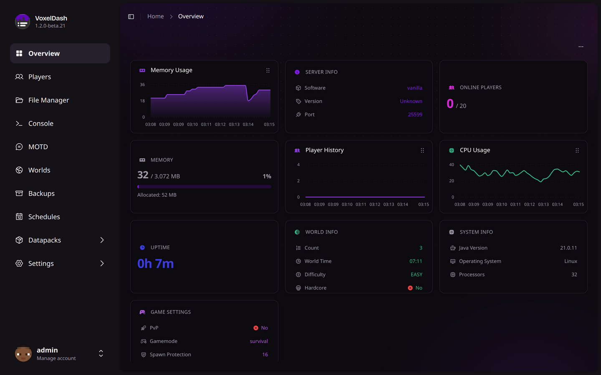
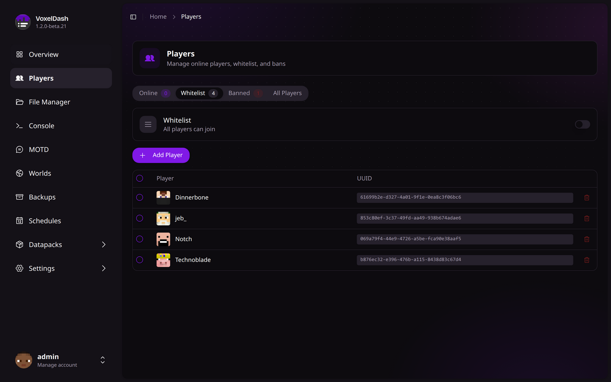
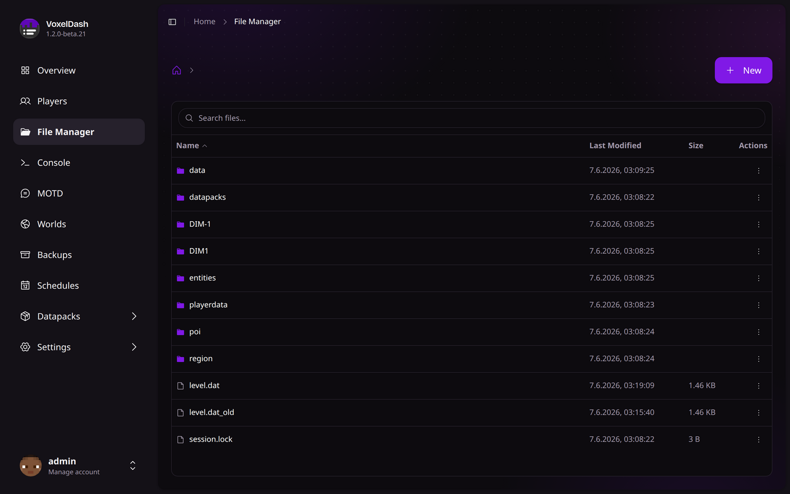
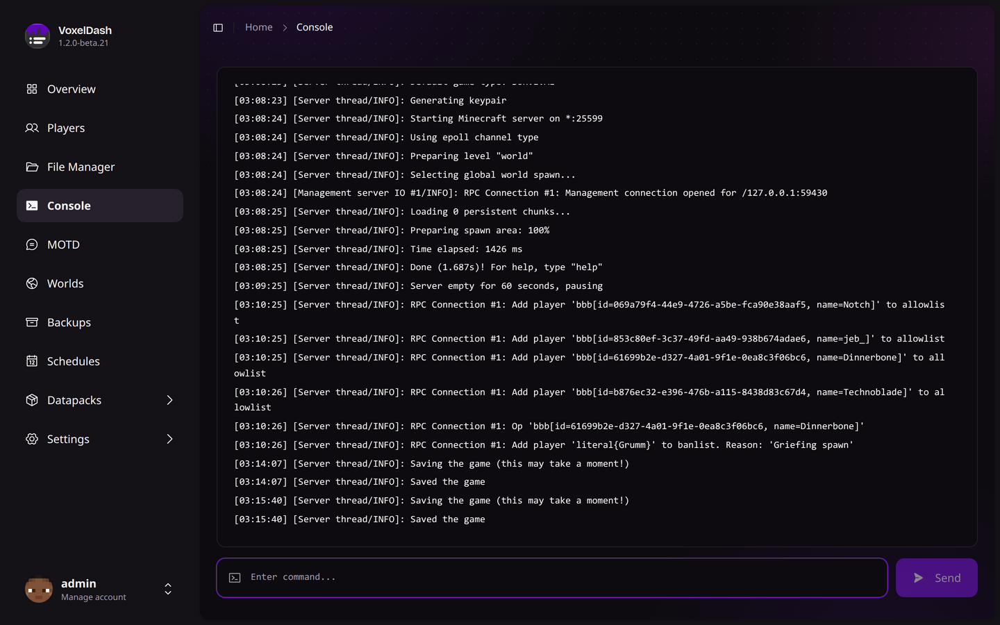
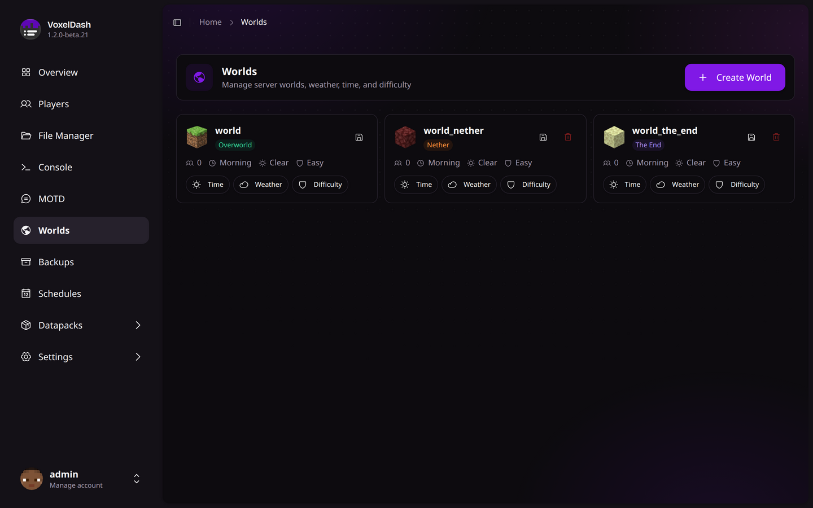
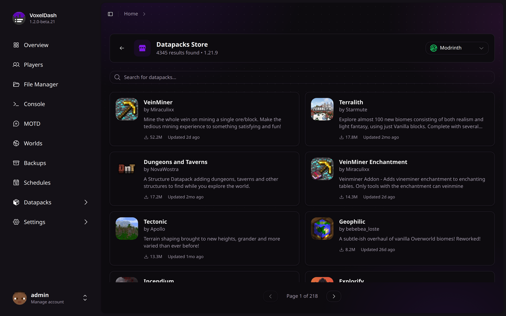
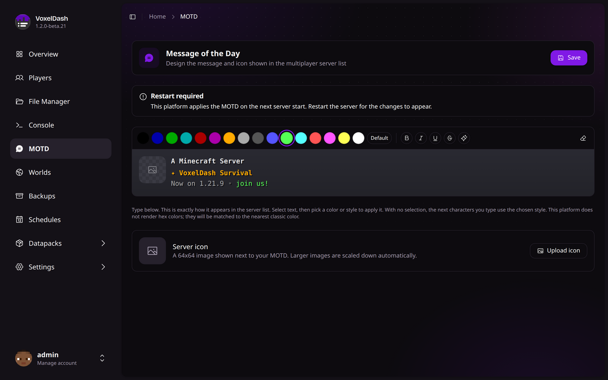
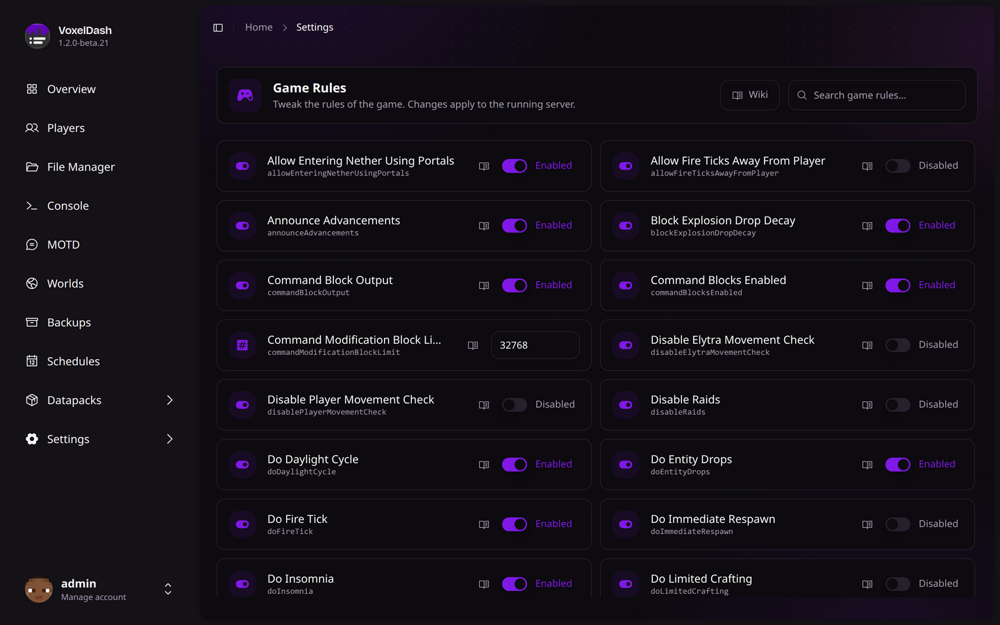

<h1 align="center"> VoxelDash</h1>

A modern, beautiful web dashboard for managing your Minecraft server <em>(formerly MCDash)</em>

  
  
  
  
  

  <a href="https://voxeldash.dev">📖 Documentation</a> · 
  <a href="https://github.com/gnmyt/VoxelDash/issues/new?template=bug_report.md">🐛 Report Bug</a> · 
  <a href="https://github.com/gnmyt/VoxelDash/issues/new?template=feature_request.md">✨ Request Feature</a>

---

## Features

VoxelDash provides everything you need to manage your Minecraft server from a sleek, modern web interface:

| Feature | Description |
|---------|-------------|
| **Dashboard** | Real-time status with customizable widgets for TPS, memory, CPU, players, and more |
| **Players** | See who's online, manage the whitelist, bans, and operators, and edit inventories or profiles |
| **File Manager** | Browse, edit, upload, and download server files right in your browser |
| **Console** | Live console output and command execution, with optional SSH access |
| **Worlds** | Manage every world's time, weather, and difficulty, or create and delete worlds |
| **Plugins & Mods** | Install and update plugins and mods from Modrinth, SpigotMC, and CurseForge |
| **Backups** | Create, restore, and download backups, manually or on a schedule |
| **Schedules** | Automate commands, broadcasts, backups, and restarts |
| **MOTD Editor** | Design the message and icon shown in the multiplayer server list |
| **Profiling** | Track live performance metrics and find out what's making your server lag |
| **Game Rules** | Tweak the game's rules from a searchable list, applied to the running server |
| **Server Settings** | Edit `server.properties` through a clean, categorized editor |

VoxelDash runs as a plugin or mod on **Spigot, Paper, Fabric, and Forge**, or as a standalone app for **vanilla** servers. You can also run it in front of multiple servers at once with [VoxelDash One](https://voxeldash.dev/voxeldash-one/introduction).

## Screenshots

  <table>
    <tr>
      <td align="center">
        
         <strong>Dashboard</strong>
      </td>
      <td align="center">
        
         <strong>Players</strong>
      </td>
    </tr>
    <tr>
      <td align="center">
        
         <strong>File Manager</strong>
      </td>
      <td align="center">
        
         <strong>Console</strong>
      </td>
    </tr>
    <tr>
      <td align="center">
        
         <strong>Worlds</strong>
      </td>
      <td align="center">
        
         <strong>Plugins &amp; Mods</strong>
      </td>
    </tr>
    <tr>
      <td align="center">
        
         <strong>MOTD Editor</strong>
      </td>
      <td align="center">
        
         <strong>Game Rules</strong>
      </td>
    </tr>
  </table>

## Quick Start

### Requirements

- Java 17 or higher
- A Minecraft server (Spigot, Paper, Fabric, or Vanilla)

### Installation

1. **Download** the latest release from the [releases page](https://github.com/gnmyt/VoxelDash/releases/latest)

2. **Install** the plugin/mod on your server:
   - **Spigot/Paper**: Place the `.jar` file in the `plugins` folder
   - **Fabric/Forge**: Place the `.jar` file in the `mods` folder
   - **Vanilla**: Run the standalone `.jar` file

3. **Start** your server and access the dashboard at `http://localhost:7867`

4. **Login** with the credentials shown in the console on first start

For detailed installation instructions, check out our [documentation](https://voxeldash.dev/getting-started/introduction).

## Tech Stack

- **Frontend**: React, TypeScript, Vite, Tailwind CSS, shadcn/ui
- **Backend**: Java, integrated with Minecraft server APIs
- **Supported Platforms**: Spigot, Paper, Fabric, Forge, Vanilla

## Contributing

Contributions are welcome! Feel free to:

1. Fork the repository
2. Create a feature branch (`git checkout -b feature/amazing-feature`)
3. Commit your changes (`git commit -m 'Add amazing feature'`)
4. Push to the branch (`git push origin feature/amazing-feature`)
5. Open a Pull Request

## License

This project is licensed under the MIT License - see the [LICENSE](LICENSE) file for details.

---

  Built with ❤️ by <a href="https://gnm.dev">GNM</a> and contributors

